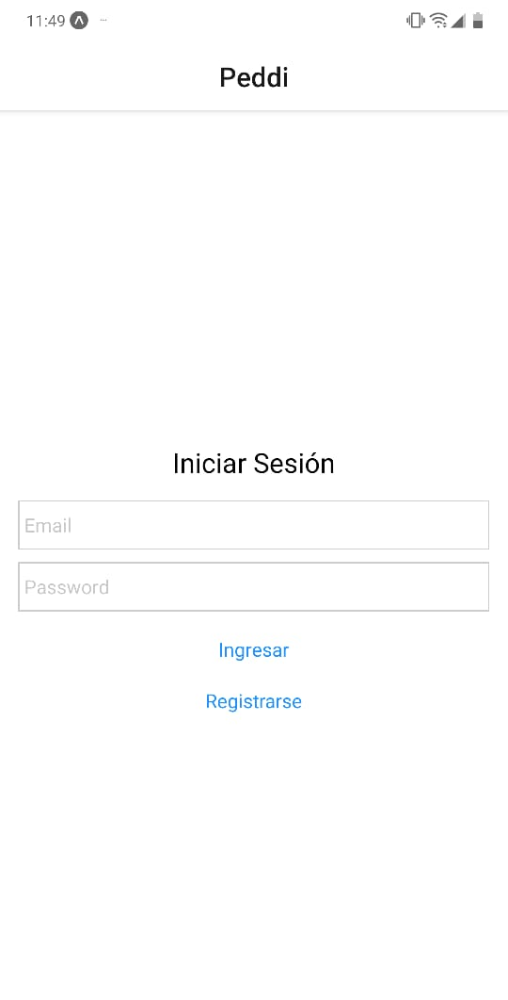
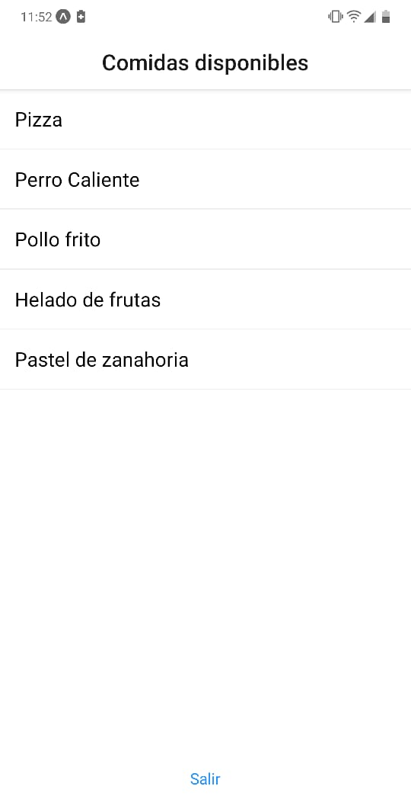
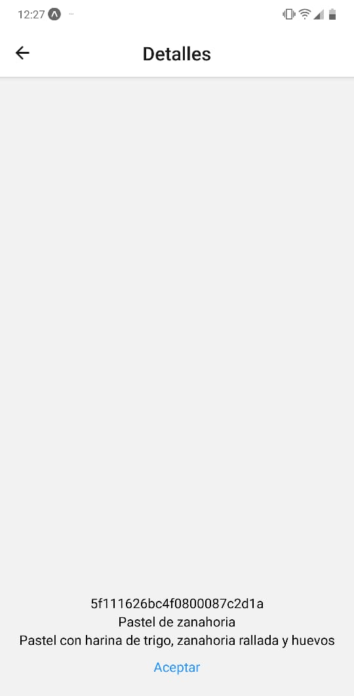

# reactNative-app_deliveryFood

this is a simple navigation example, with the next components: 
 * createAppContainer
 * createSwitchNavigator
 * createStackNavigator
 
 Snaps: 
 1. Login Screen:
 

 2. Meals:
 

 3. Order Screen:
 

  
 
*Enjoy!*

Note: Feel free to use the api ;)
